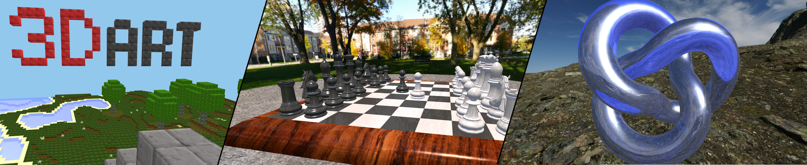

<!--
I used to be with it, but then they changed what it was.
Now what I'm with isn't it, and what's it seems weird and scary to me.
It'll happen to you!
-->

## Welcome to Grant Nelson's Personal Account

### Featured Projects

[ThreeDart Live Examples](https://grant-nelson.github.io/ThreeDart/build/) | [ThreeDart Repo](https://github.com/Grant-Nelson/ThreeDart)

[OpenSimplexNoiseDart Repo](https://github.com/Grant-Nelson/OpenSimplexNoiseDart)

### Work Info

- **[My Workiva Github Account](https://github.com/grantnelson-wf)**
     I've been a Senior Software Engineer at Workiva since 2014.

- **[Snow Gremlin LLC](http://github.com/Snow-Gremlin)**
     I am a manager at Snow Gremlin, lead developer for
    Snow Gremlin's projects, and consultant with
    expertise in software quality and embedded systems.

- **[Software Engineering and Cybersecurity Laboratory (SECL)](https://www.montana.edu/cyber/)**
     I am researching technical debt analysis of procedural languages
    at SECL as a PhD student at Montana State University.

### Publications

- **[The Causal Graph CRDT for Complex Document Structure](https://dl.acm.org/doi/10.1145/3209280.3229110)**
     by Aaron Hall, Grant Nelson, Mike Thiesen, Nate Woods

- **[A Gap in the Analysis of Technical Debt in Procedural Languages: An Experiential Report on Go](https://ieeexplore.ieee.org/document/9509587)**
     by Grant Nelson, Clemente Izurieta

- **[Membership and Participation in Object Oriented and Procedural Paradigms](https://ieeexplore.ieee.org/document/10152127)**
     by Grant Nelson, Clemente Izurieta, Derek Reimanis
